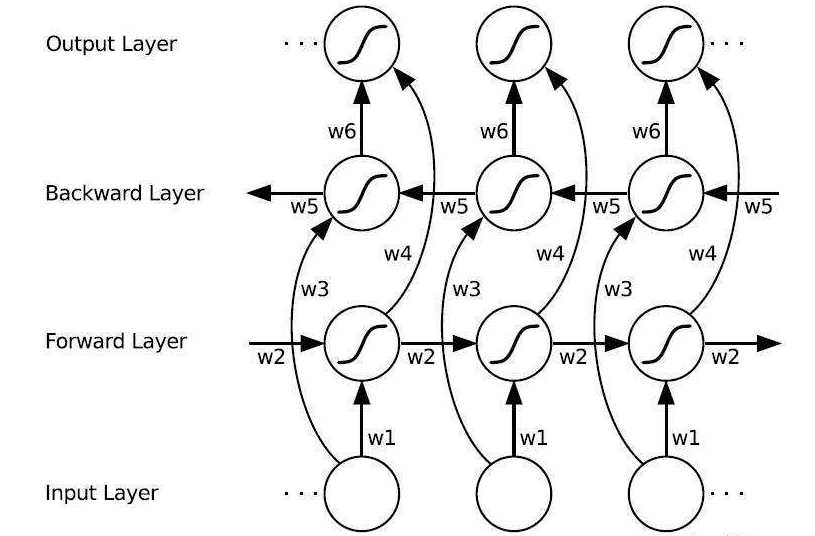
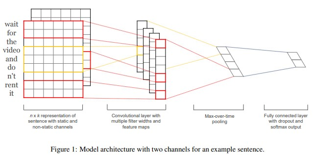
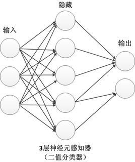
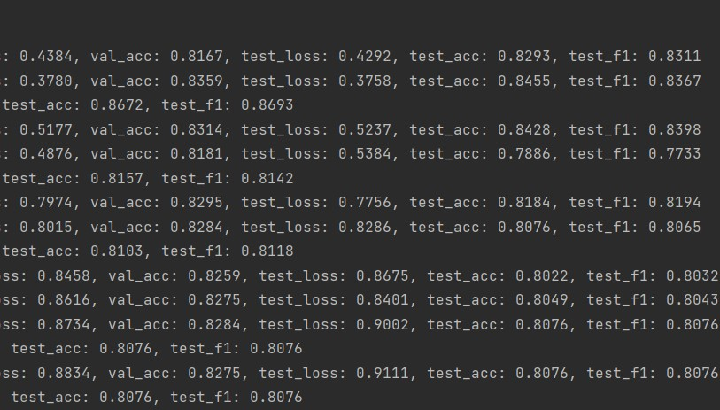
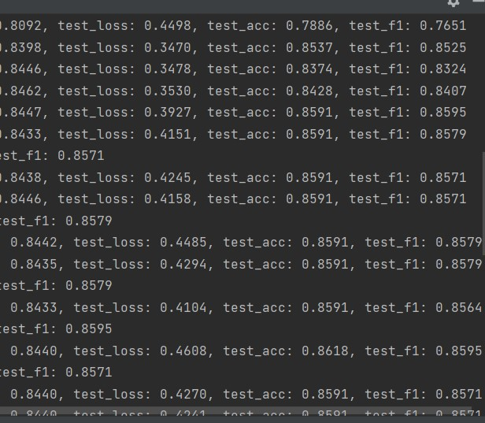

#情感分析实验报告
计13 周晋 2021010743

##模型结构
- RNN-LSTM

双向LSTM模型。流程为：
将（对整个文本分块后得到的）相同长度的句子读入，映射为指定长度的向量，再将这些词向量输入LSTM层，每个LSTM单元分别在前后两个方向产生隐藏状态，向前后传递信息，把第二层头尾的两个单元的隐藏状态输入线性层，产生最终的预测结果。
- CNN

TEXT-CNN模型。流程为：
单词映射同上。将得到的向量视为一维张量，长度为对齐后的句子长度，用宽度为3，5，7的卷积核分别做三次卷积，再进行池化，最后输入线性层得到预测结果。
- MLP

MLP模型。流程为：
单词映射同上。将得到的向量直接拼接，通过线性神经元层，输出指定大小的张量，最后得到预测结果。
##实验结果
分别进行了20次训练，三种模型均收敛（LOSS不再下降，且准确率保持稳定），结果如下（收敛值）：
|类型|准确率|F-Score|
|---|---|---|
|RNN|0.8076|0.8076|
|CNN|0.8591|0.8571|
|MLP|0.8157|0.8182|
可以看到CNN最高，MLP次之，RNN最小
##参数对比
参数过多，本次实验仅针对训练次数问题进行讨论,如下为RNN和CNN准确率随训练次数的变化趋势：

可以看到，两个模型分别在第十次、第七次到达收敛。CNN模型准确率逐步增加至稳定；而RNN模型的准确率在少量提高后达到最大值0.8693.，从第四次开始快速减少，最后到达一个较低的稳定值，该值甚至小于MLP的稳定值，可以推测发生了过拟合。由此考虑，可以适当调整训练次数，以达到较好的准确率，而非过拟合后的稳定值。
##思考题
- 训练停止问题：
  我通过设置固定测试次数实现，观察得到的收敛结果如上。笔者认为主要应该通过观察历次训练结果的数据来确定收敛次数，当取到合理的最高值且loss较低时停止训练，当准确率还在提高时显然应继续训练，而当准确率收敛到较低值时，需要回溯历次数据，来确定更少的训练次数。
  固定迭代次数的方式可以较为准确地找到想要的结果，但当训练次数过多才能到达收敛时，需要多次调整，时间成本较高；而验证集调整等方法通过设计良好的算法也可以得到较好的结果，但不一定符合最优的要求，且需要更多的设计成本。
- 参数初始化
  RNN与CNN采用kaiming初始化，MLP采用高斯初始化。
  高斯初始化（含零均值初始化）：适合较小的模型，层次过深会导致梯度影响减小；
  正交初始化：适合深度模型，有效减少梯度消失问题；
  kaiming初始化：是对Xavier初始化的改进，适用于relu函数。
- 过拟合问题解决方法
  1、增加样本量，选取更大、更普遍的样本；
  2、观察历次训练结果，选择适当的而非过多的训练次数；
  3、减少参数量，降低模型复杂度，使其与相应的样本匹配。
- 模型对比
  ||CNN|RNN|MLP|
  |---|---|---|---|
  |优点|更好地处理局部信息|携带时序信息；可以处理任意长度|模型简单，易于实现|
  |缺点|长度固定，容易丢失信息|容易过拟合|模型扩展性不强，只能到达一定的准确率，难以优化|
##总结
honorcode:参考往年学长的模型设计；
收获：初步学会了pytorch的使用；实际感受到了参数设计的困难，与其对最终结果的显著影响；为进一步学习深度学习打下基础。